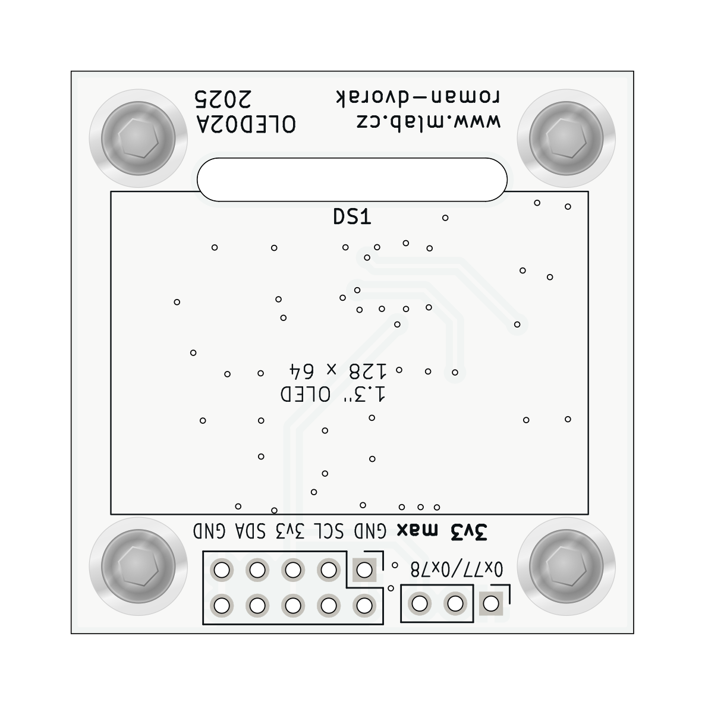
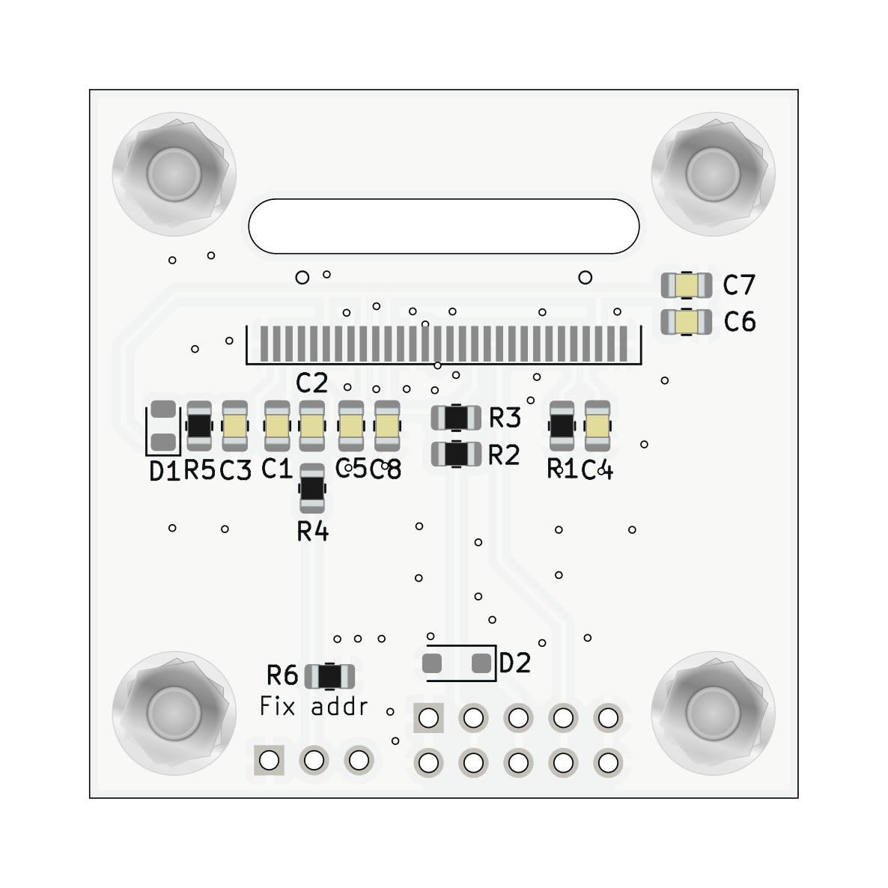

# OLED02 Display with I2C interface

The **OLED02A** is a simplified variant of the MLAB OLED01 module. It features a 1.3-inch blue OLED display using the SSD1306BZ controller and communicates over an I²C interface.

## Features

- **Display**: 1.3-inch passive matrix OLED with a resolution of 128x64 pixels.
- **Color**: Blue.
- **Controller**: SSD1306BZ.
- **Interface**: I²C.
- **Power Supply**:
  - Logic: 3.0 V typical (2.8 V min, 3.3 V max).
  - Display: Internally generated by integrated DC/DC converter.
- **Address Configuration**: Default I²C address is `0x3C`, changeable to `0x3D` via onboard jumper.
- **Mounting**:
  - Horizontal MLAB standard.
  - Optional vertical placement using a 3D-printed holder.

## Electrical Characteristics

- **Operating Voltage (Logic)**: 2.8 V to 3.3 V
- **Operating Current**: \~10 mA @ 12 V VCC (internally generated)
- **Interface Voltage Levels**: TTL-compatible (0 to 3.3 V)

## Optical Characteristics

- **Contrast Ratio**: 2000:1
- **Brightness**: 60–80 cd/m² (typical with 50% checkboard)
- **Viewing Angle**: 160° (H and V)
- **Response Time**: 10 µs (rise and fall)
- **Display Technology**: Passive matrix
- **Pixel Size**: 0.148 mm x 0.148 mm
- **Dot Pitch**: 0.17 mm x 0.17 mm
- **Active Area**: 21.738 mm x 10.858 mm

## Mechanical Parameters

- **Board Dimensions**: 40.14 mm x 40.14 mm
- **Board Thickness**: 1.6 mm
- **Mounting**: Compatible with standard MLAB module placement

## I²C Pin Configuration (Standard MLAB I2C Layout)

| Pin | Name | Description       |
| --- | ---- | ----------------- |
| 1   | GND  | Ground            |
| 2   | SDA  | Serial Data       |
| 3   | 3V3  | 3.3V power supply |
| 4   | SCL  | Serial Clock      |
| 5   | GND  | Ground            |

## I²C Address Selection

The OLED02A module uses `0x3C` as its default I²C address. By bridging the onboard address jumper, the address switches to `0x3D`.

## Notes

- OLED02A omits certain advanced features present in OLED01 to simplify integration and reduce cost.
- The module uses only the I²C interface; SPI and parallel interfaces supported by the SSD1306BZ are not routed.
- Ensure proper handling precautions for OLEDs to prevent damage or screen burn-in.
- Refer to the [SSD1306 datasheet](https://www.vishay.com/doc?37902) for command interface details.

